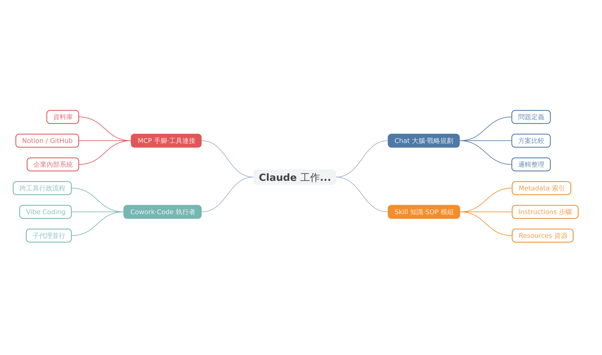

# Claude 全方位生產力手冊

從 Chatbot 到 Agent — 建構可用、可管、可擴張的 AI 工作系統

企業 AI 導入課程 ・ 約 50 分鐘

<!-- Speaker notes: 歡迎大家。今天這堂課的目標很簡單——讓你看懂 Claude 不只是「更強的 ChatGPT」，而是一整套可以改造組織工作方式的代理系統。我們會從範式轉移出發，一路走到企業怎麼真正把它用起來。 -->

---

<!-- _class: agenda -->

## 今日學習目標

1. 說明 AI 從 **Chatbot** 到 **Agent** 的範式轉移
2. 比較 Claude 四層架構（Chat / Skill / MCP / Cowork-Code）的職責分工
3. 應用 **Opus / Sonnet / Haiku** 模型分層策略規劃成本效益
4. 分析 **Skill 與 MCP** 的互補關係與規模化價值
5. 評估企業建構 **「可用、可管、可擴張」** AI 工作系統的路徑

<!-- Speaker notes: 五個目標，覆蓋從觀念到落地的整條線。這堂課沒有程式碼，但會讓你帶著一張「可以拿給老闆看的架構圖」離開。 -->

---

<!-- _class: lead -->

# 第一章

## 範式轉移：從 Chatbot 到 Agent

<!-- Speaker notes: 先丟一個問題給大家——你現在用 AI，是在「問它問題」還是在「交代它任務」？這兩者差別在哪？我們這一章要講清楚。 -->

---

<!-- _class: comparison -->

## 問答者 vs 工作協作者

### Chatbot 時代

- 被動等問題
- 回覆文字答案
- 單次對話即結束
- 評估標準：「答得準不準」

VS

### Agent 時代

- 理解任務目標
- 拆解步驟、調用工具
- 跨流程持續參與
- 評估標準：「能不能交付」

<!-- Speaker notes: 這張對比其實就是整堂課的入口。左邊是 2023 年以前的 AI，右邊是 2025 年之後的 AI。注意評估標準那行——從「答得準」變成「能不能交付」，這是企業 KPI 層級的改變。 -->

---

<!-- _class: key-point -->

## 範式轉移的一句話結論

AI 的角色，從「單點回覆者」變成「任務流程中的工作協作者」。

企業要問的不再是「它能不能生成答案」，而是「它能不能穩定參與流程、在可控範圍內產出成果」。

<!-- Speaker notes: 這句話請各位記下來，它是後面所有內容的錨點。當我們談 Skill、談 MCP、談 Cowork，都是在回答同一個問題——怎麼讓 AI 真的「做事」。 -->

---

<!-- _class: lead -->

# 第二章

## Claude 四層架構總覽

<!-- Speaker notes: Claude 不是一個單一產品，它是四層分工的系統。接下來這張圖，會是你之後跟同事解釋 AI 架構時最常用的那張。 -->

---

<!-- _class: highlight-box -->

## 漸進式揭露的四層分工

- **Chat（大腦）** — 戰略規劃、邏輯辯證、問題定義
- **Skill（知識）** — 專業 SOP 模組化的「數位食譜」
- **MCP（手腳）** — 連接外部工具與資料庫，打破資訊孤島
- **Cowork / Code（執行者）** — 在受控環境中交付實際成果

四層依任務需求**逐層啟用**——降低上下文負擔、便於權限管理。

<!-- Speaker notes: 注意「漸進式揭露」這四個字——這是整個架構的核心設計哲學。AI 不需要一次把所有能力都打開，而是依任務需要一層一層載入，這樣既省 token 又好管理。 -->

---

<!-- _paginate: false -->

<!-- Speaker notes: 看這張圖的走向——使用者把任務丟給 Chat，Chat 判斷要調哪些 Skill、接哪些 MCP，最後交給 Cowork 或 Code 層去實際做事。這就是 Agent 的工作方式。 -->

---

<!-- _class: lead -->

# 第三章

## Chat 模式 — 決策者的指揮中心

<!-- Speaker notes: 很多人以為 Chat 就是聊天，錯。在企業情境下，Chat 是「邏輯整形層」——它不是回答你，它是幫你想清楚。 -->

---

<!-- _class: highlight-box -->

## Chat 承接的三類高價值任務

- **問題定義** — 把模糊需求（「業績不好怎辦」）轉為可執行方案
- **方案比較** — 列出選項、利弊分析、辨識風險
- **邏輯整理** — 把零散資訊（會議紀錄、郵件、備忘）轉為提案架構

共通點：**都是「把亂的變清楚」，不是「把空的變有」**。

<!-- Speaker notes: 請注意最後那行——Chat 的強項是整理已有資訊，不是無中生有。當你手上有料但理不清，它就是你的外掛；當你什麼都沒有，它也變不出來。 -->

---

## 模型選擇：不是一律選最強

| 模型 | 定位 | 適用任務 | 成本 |
|---|---|---|---|
| **Opus 4** | 深度推理 | 高複雜度戰略、關鍵決策、長文分析 | 高 |
| **Sonnet 4** | 日常主力 | 方案比較、邏輯整理、一般生產力 | 中 |
| **Haiku 4** | 前線篩選 | 高頻低複雜度、即時回應、批次處理 | 低 |

**策略**：80% 的任務用 Sonnet 夠，Opus 留給真正值得的 20%，Haiku 處理高頻作業。

<!-- Speaker notes: 這張表請老闆看最有感——模型分層就是成本分層。公司導入 AI 最常犯的錯就是「一律用最貴的」，結果一個月帳單嚇死人。用對模型，比用最強模型更重要。 -->

---

<!-- _class: lead -->

# 第四章

## Cowork 模式 — 個人數位工作助理

<!-- Speaker notes: 如果 Chat 是軍師，Cowork 就是你的助理。差別在——它不只給建議，它真的會幫你做事。 -->

---

<!-- _class: highlight-box -->

## Cowork 的五大核心能力

- **環境隔離** — 沙盒執行，資料主權保留在你這邊
- **多模態處理** — 紙本 → Excel → Word 自動格式轉換
- **子代理並行** — 大任務拆成小任務同時跑，避免目標模糊
- **自動化排程** — 節奏化執行，不用每次手動觸發
- **遠端調度** — 手機也能交代任務，實現行動化辦公

定位：企業知識工作的**「中台執行層」**。

<!-- Speaker notes: 舉個真實場景——你收到一疊紙本發票，以前要自己掃、key 進 Excel、做成報帳單，現在交給 Cowork，它跑一次就全搞定。這不是聊天，這是勞動力。 -->

---

<!-- _class: quote -->

## 什麼是「中台執行層」？

> Cowork 打破 AI 僅能「提供建議」的限制，在受控環境下模擬人類操作，完成跨工具的行政流程。它不回答你問題，它**完成**你的工作。

<!-- Speaker notes: 這個定義請記住——「模擬人類操作、完成跨工具流程」。這就是為什麼它叫「中台」，因為它站在你跟所有工具中間，把原本需要你切來切去的活，全包了。 -->

---

<!-- _class: lead -->

# 第五章

## Code + Skill + MCP — 工程化的能力擴張

<!-- Speaker notes: 前面講的都是使用者能直接看到的層，現在我們來看引擎蓋底下——讓 Claude 能規模化的兩個關鍵：Skill 跟 MCP。 -->

---

<!-- _class: highlight-box -->

## Skill 的三層漸進式結構

- **Metadata** — 名稱、描述、觸發條件（Claude 判斷什麼時候該用這個 Skill）
- **Instructions** — 核心 SOP、步驟、判斷邏輯（真正的「怎麼做」）
- **Resources** — 範本、範例、參考檔案（需要時才載入）

**設計哲學**：不是把整本手冊塞進 prompt，而是**「先看目錄，需要時翻章節」**——這就是 token 效率的關鍵。

<!-- Speaker notes: 這三層結構背後有個重要觀念——不是每次都把所有資訊丟給 AI。先給它一張目錄（Metadata），它判斷要不要進來；決定用了才讀 Instructions；遇到具體情境才翻 Resources。這就是「漸進式揭露」。 -->

---

<!-- _class: comparison -->

## Skill vs MCP — 不是二選一

### Skill（會不會做）

- 解決**方法封裝**
- 把 SOP 轉成可重複調用
- 讓 AI「知道做事的步驟」
- 組織的**隱性 know-how**
- 例：合約審閱 SOP

VS

### MCP（做不做得到）

- 解決**工具連接**
- 接入 Notion、GitHub、DB
- 讓 AI「拿得到做事的工具」
- 組織的**外部系統**
- 例：連到公司 CRM 抓資料

<!-- Speaker notes: 常見迷思是「有了 MCP 就不需要 Skill」。錯。Skill 是「會不會做」，MCP 是「做不做得到」。就算你有打開門的鑰匙（MCP），你還是得先知道該開哪扇門（Skill）。 -->

---

<!-- _class: key-point -->

## Skill × MCP 的乘法效應

Skill 把你的**方法**封裝進 AI。

MCP 把你的**工具**接給 AI。

兩者相乘，AI 才真正從「知道」走向「做到」——這就是企業 AI 規模化的基礎設施。

<!-- Speaker notes: 這頁是整堂課的技術核心。記住這個乘法——方法 × 工具 = 真正的生產力。少掉任何一邊，AI 都還停在「建議層」上不了戰場。 -->

---

<!-- _class: lead -->

# 第六章

## 企業 AI 工作系統的建構路徑

<!-- Speaker notes: 最後一章，我們從技術拉回組織層面——怎麼把這些能力真的裝進你的公司。 -->

---

## 真正的競爭優勢，不在模型數量

從「人使用工具」 演進為「人管理代理、代理執行工作」

誰更早建立「**可用、可管、可擴張**」的 AI 工作系統，誰就贏在下個十年。

<!-- Speaker notes: 把這三個詞寫在你的白板上——可用、可管、可擴張。它們不是口號，是三個可以拆成檢查清單的治理指標。可用看體驗、可管看風險、可擴張看架構。 -->

---

<!-- _class: summary -->

## 今日重點回顧

- **範式轉移** — AI 從問答者變成工作協作者，評估標準從「答得準」變成「能交付」
- **四層架構** — Chat（大腦）/ Skill（知識）/ MCP（手腳）/ Cowork-Code（執行者）
- **模型分層** — Opus 戰略、Sonnet 主力、Haiku 前線，用對比用強更重要
- **Skill × MCP** — 方法 × 工具的乘法效應，是規模化的基礎設施
- **治理指標** — 可用、可管、可擴張，三者缺一不可

**一週行動**：挑一個你最常做的 SOP，試著寫成 Skill 雛型。

<!-- Speaker notes: 重點都在這。最後的一週行動是今天唯一的作業——不要只是聽完就走，挑一個你自己最熟的流程，下週回來我們看誰先寫出第一個 Skill。 -->

---

## 引用來源

1. Claude 全方位生產力手冊 — 使用者提供之原始文章（accessed 2026-04-13）¹

**延伸閱讀方向**：

- Anthropic 官方文件（Claude Agent Skills / MCP 規格）
- Model Context Protocol 開源標準 — https://modelcontextprotocol.io
- 企業 AI 導入案例——建議搭配 Notion、GitHub、CRM 等 MCP 實作觀摩

<!-- Speaker notes: 今天的內容主要整合自使用者提供的原始文章，並對應到 Anthropic 官方架構。延伸學習請沿著 MCP 的開源標準與實作範例繼續深入。 -->
