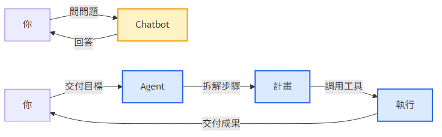
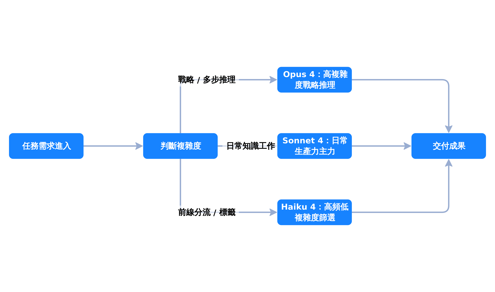
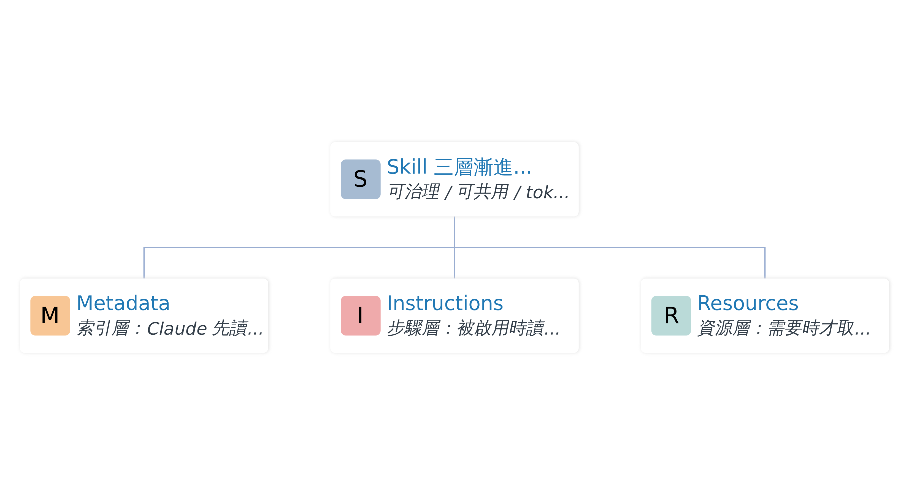

# Claude 全方位生產力手冊

從 Chatbot 到 Agent，AI 工作系統的設計藍圖

知識工作者・組織決策者　|　約 50 分鐘

<!-- Speaker notes: 大家好，歡迎來到這堂課！今天我們不是要學「怎麼跟 AI 聊天」，而是要重新理解：當 AI 從問答機器變成代理人，我們的工作方式會變成什麼樣子？準備好了嗎？我們開始。 -->

---

<!-- _class: agenda -->

## 今天你會學到

1. **看懂**範式轉移——AI 為什麼不再只是 Chatbot
2. **拆解** Claude 四層架構（Chat / Skill / MCP / Cowork·Code）
3. **比較** Chat / Cowork / Code 三大模式的舞台
4. **判斷** Opus / Sonnet / Haiku 該用哪一個
5. **規劃**組織導入「可用、可管、可擴張」的 AI 系統

<!-- Speaker notes: 我們會走過 5 個學習目標。前兩個建立心智模型，中間兩個聚焦實戰決策，最後一個拉到組織層級。如果你只想記一件事——記住「分層」這兩個字就夠了。 -->

---

<!-- _class: lead -->

# 1. 範式轉移

從「會回答」到「會做事」

<!-- Speaker notes: 第一章。先問大家一個問題：你最近一次用 AI 做事，是「請它回答我」，還是「請它幫我完成」？這兩件事中間，差了一個範式。 -->

---

<!-- _paginate: false -->

<!-- Speaker notes: 看出差別了嗎？Chatbot 的迴圈只繞一次：你問、它答。Agent 的迴圈是：理解目標、拆解步驟、調用工具、回報結果。它接管的是整段流程，不是一句回應。Mermaid 原始碼存於 diagrams/chatbot-vs-agent.mmd，由 mmdc 預先渲染為 PNG。 -->

---

<!-- _class: comparison -->

## 評估標準變了

### 過去的問題

「AI 能不能**生出答案**？」

關注：回答品質、語言流暢度、知識正確性

VS

### 現在的問題

「AI 能不能**穩定交付**？」

關注：流程參與度、工具串接、可控性、可重現性

<!-- Speaker notes: 注意這個轉變——以前我們挑 AI，看它「答得好不好」；現在挑 AI，看它「能不能在我的流程裡跑下去」。這是企業評估標準的根本翻轉。 -->

---

<!-- _class: lead -->

# 2. 四層架構

一張地圖，貫穿整堂課

<!-- Speaker notes: 第二章。如果今天只能帶走一張投影片，就是接下來這一張。請大家把這張圖記在腦中——後面所有討論都會回到這四層。 -->

---

<!-- _paginate: false -->

<!-- Speaker notes: Chat 是大腦——做戰略、做判斷。Skill 是知識——把專業 SOP 模組化。MCP 是手腳——連接外部工具。Cowork 和 Code 是執行者——在受控環境裡真的把事情做完。四層分工，缺一不可。 -->

---

<!-- _class: key-point -->

## 為什麼要分層？

> 上下文視窗有稅。
> 一次塞一萬個工具，等於沒有工具。

**漸進式揭露**讓 AI 依任務需求逐層啟用——降低 token 成本、便於權限管理、讓系統可治理。

<!-- Speaker notes: 這個概念叫「上下文視窗稅」。如果你把所有能力都塞進一個 prompt，模型反而選不出來該用哪個。分層的本質是：先看任務，再決定打開哪一層。這就是 progressive disclosure。 -->

---

<!-- _class: lead -->

# 3. Chat 模式

決策者的指揮中心

<!-- Speaker notes: 第三章，進入 Chat。很多人以為 Chat 就是「問答視窗」，其實不是——它是企業知識工作的「邏輯整形層」。 -->

---

<!-- _class: highlight-box -->

## Chat 的三類高價值任務

- **問題定義**——把模糊需求轉成可執行方案
- **方案比較**——利弊分析、風險辨識、權衡取捨
- **邏輯整理**——零散資訊整成提案架構

> 你猜一週裡，這三件事佔你多少時間？多數知識工作者：**超過六成**。

<!-- Speaker notes: 大家在心裡盤算一下——你每週開的會、寫的文件、回的 email，有多少是在做這三件事？這就是 Chat 真正的舞台。不是「請幫我寫個 hello world」，是「請幫我想清楚這件事」。 -->

---

<!-- _paginate: false -->

<!-- Speaker notes: 看這張選模型流程圖：複雜戰略推理 → Opus，日常生產力 → Sonnet，高頻篩選 → Haiku。一律選最強，等於用挖土機挖花盆——慢、貴，而且未必更準。 -->

---

3 選 1

不是「選最強」，是「選最對」

Opus = 戰略腦　·　Sonnet = 主力車　·　Haiku = 前線斥候

<!-- Speaker notes: 三選一，講的不只是模型。是一種思考方式——任務有層級，工具就要有層級。如果你的團隊現在只用一種模型做所有事，你正在付不必要的成本。 -->

---

<!-- _class: lead -->

# 4. Cowork 模式

個人數位工作助理

<!-- Speaker notes: 第四章，Cowork。如果 Chat 是「想清楚」，Cowork 就是「真的去做」——它能在受控環境裡操作工具、跨檔案處理、自動排程。 -->

---

<!-- _class: card -->

## Cowork 的四項執行力

### 環境隔離
資料主權保護、權限可控

### 多模態處理
紙本 → Excel → Word 跨格式自動轉換

### 子代理並行
一次拆出多條線同步推進，目標不模糊

### 自動排程 × 遠端調度
節奏化執行，手機在哪工作就在哪

<!-- Speaker notes: 想像一下：早上你交付一個任務「整理上週客訴並產出回應草稿」，Cowork 自己打開 Excel、跨檔案比對、生成 Word 草稿、放回共享資料夾——你下午回來收成。這就是中台執行層。 -->

---

<!-- _class: quote -->

## 一句話記住 Cowork

> 「AI 不再只是給你建議，它已經把你下班前該做的事，做完一半了。」

——這是企業知識工作的中台執行層。

<!-- Speaker notes: 這句話請大家放心裡。從「給建議」到「做一半」，這中間跨過的不是技術門檻，是工作關係的轉變——你跟 AI 的關係，從顧問變成同事。 -->

---

<!-- _class: lead -->

# 5. Code × Skill × MCP

生態系的戰略三角

<!-- Speaker notes: 第五章。這章資訊密度最高——我們要看 Code 模式、Skill、MCP 三件事怎麼互相成就。準備好筆記。 -->

---

<!-- _paginate: false -->

<!-- Speaker notes: Skill 的三層結構：Metadata 告訴 AI「我有這個能力」、Instructions 告訴 AI「這個能力怎麼用」、Resources 才是大量資料和範本。AI 預設只看到 Metadata，需要時才展開——這就是 token 效率的關鍵。 -->

---

<!-- _class: comparison -->

## 兩個常見誤解

### ❌「Skill 就是更長的 prompt」

Skill 是**三層漸進式**結構，可治理、可共用、token 可控。Prompt 是一次性指令，沒有層級。

≠

### ❌「有 MCP 就不用 Skill」

MCP 解決「**做不做得到**」（工具連接），Skill 解決「**會不會做**」（方法封裝）。互補，不替代。

<!-- Speaker notes: 這兩個誤解，幾乎是企業 PoC 階段最常踩的雷。Skill 不是 prompt 的延伸，是知識的封裝；MCP 不是 Skill 的取代，是兩條不同維度的能力。記住：MCP 是肌肉，Skill 是肌肉記憶。 -->

---

<!-- _class: lead -->

# 6. 落地

從個人工具到組織引擎

<!-- Speaker notes: 最後一章，把視野拉到組織。前面講的所有能力，如果只停在「某個工程師很會用」，那不叫導入 AI。真正的競爭力，是把這些能力做成「組織級基礎設施」。 -->

---

<!-- _class: process -->

## 落地四步驟

1

<strong>清楚分層</strong> 思考層 / 知識層 / 工具層 / 執行層

2

<strong>SOP 制度化</strong> 把專業流程封裝成 Skill

3

<strong>工具標準化</strong> 用 MCP 接入內外部系統

4

<strong>人機治理化</strong> 定義誰決策、誰執行、誰審核

<!-- Speaker notes: 四步走完，你不再是「會用 AI 的公司」，而是「擁有 AI 工作系統的公司」。差別在哪？前者依賴某幾個高手，後者建立可複製的能力。下次有新員工進來，你交給他的不是工具，是系統。 -->

---

<!-- _class: summary -->

## 今日重點回顧

- AI 已從 Chatbot **進化為 Agent**——評估標準從「會答」變「會做」
- Claude 的**四層架構**（Chat / Skill / MCP / Cowork·Code）是漸進式揭露的工作系統
- Chat 做戰略、Cowork 做執行、Code × Skill × MCP 是企業規模化的三角支柱
- **模型選擇分層**：Opus 戰略 / Sonnet 主力 / Haiku 高頻——不要一律選最強
- 真正的優勢：建立「**可用、可管、可擴張**」的 AI 工作系統

<!-- Speaker notes: 五個重點，五個學習目標一一對應。今天回去如果只能執行一件事——回去畫出你目前工作流的四層架構，看看哪一層空著。空著的那層，就是你下個月該動工的地方。 -->

---

## 引用來源

1. Claude 全方位生產力手冊——使用者提供之原始文章 ¹（accessed 2026-04-13）

### 延伸閱讀方向

- Anthropic 官方文件：Claude Skills、MCP（Model Context Protocol）規格
- Edge-TTS / Marp 開源工具用於教材自動化
- 企業 AI 治理：人機分工 SOP、權限分層、Audit log

> 本課所有事實敘述均來自上述原始資料，未引入額外外部來源。

<!-- Speaker notes: 引用就一份，是各位提供的原始文章。延伸閱讀方向我列了三條，大家可以照興趣往下挖。Q&A 時間留 3 分鐘——有沒有人想分享你目前公司在哪一層卡關？ -->
