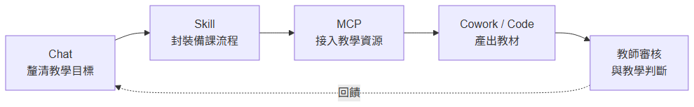

# Claude 全方位生產力手冊

從 Chatbot 到 Agent：教師與研究人員的 AI 工作系統

教育科技研修課程 ｜ 約 54 分鐘

<!--
Speaker notes: 歡迎各位老師與研究夥伴。今天我們要系統地走一遍 Claude 的四層架構，理解 AI 從聊天機器人進化為數位代理人對備課與研究的具體意義，並在最後規劃一套可重複、可累積的個人化 AI 工作流。
-->

---

<!-- _class: agenda -->

## 課程地圖

1. 從 Chatbot 到 Agent：AI 範式轉移（約 8 分鐘）
2. 四層架構：漸進式揭露的工作系統（約 10 分鐘）
3. Chat 模式與模型選擇策略（約 10 分鐘）
4. Cowork 模式：數位工作助理（約 8 分鐘）
5. Code、Skill 與 MCP：工具、知識與連接（約 10 分鐘）
6. 建構個人化 AI 工作系統（約 8 分鐘）

**學習目標**：釐清範式轉移、辨認四層架構、選對模型、設計個人工作流。

<!--
Speaker notes: 這份課程地圖同時對應六個章節與五條學習目標。每個章節結束時請對照地圖，回想此刻我們落在哪個層級——這會在第六章的工作系統設計中再次回收。
-->

---

<!-- _class: lead -->

# 第 1 章
## 從 Chatbot 到 Agent

AI 從被動回答，進化為主動規劃、調用工具、交付成果的數位代理人。

<!--
Speaker notes: 進入第一章。本章要解決的核心問題是——當我們說「AI 已經不一樣了」，這個「不一樣」到底改變了什麼。我們會從兩種互動模式的結構差異切入。
-->

---

<!-- _class: comparison -->

## 被動問答 vs 主動交付

### Chatbot

- 使用者提問、AI 回答
- 單輪互動、無延續記憶
- 產出文字，由人再加工
- 適用：查詢、摘要、翻譯

VS

### Agent

- 使用者交付任務目標
- 拆解步驟、調用工具
- 產出可直接使用的成果
- 適用：備課、研究、行政流程

<!--
Speaker notes: 請特別注意右欄第三行。Agent 的最大差異不是更聰明，而是交付物的形式改變了——從「文字建議」變成「已完成的工作」。這是本課程理解後續所有功能的基礎。
-->

---

<!-- _paginate: false -->

<!--
Speaker notes: 這張流程圖把兩種模式的互動結構並列。上半部是閉環的一問一答；下半部則可見 Agent 將任務拆解為計畫、調用工具、執行、交付的四階段鏈。請記住這個形狀——後續四層架構的設計動機，就是為了把下半條鏈做得更好。
-->

---

<!-- _class: key-point -->

## 範式轉移的教學意義

AI 不再只是「幫你查資料」的工具，
而是能承接「從主題到教學影片」全流程的協作者。

<!--
Speaker notes: 小結第一章。當我們把 AI 從工具視角切換為協作者視角，備課的瓶頸會從「蒐集資訊」移轉到「設計流程與審核品質」——這也是本課程第六章要回答的終極問題。
-->

---

<!-- _class: lead -->

# 第 2 章
## 四層架構

Chat、Skill、MCP、Cowork/Code 的分層設計，讓 AI 依任務需求逐層啟用。

<!--
Speaker notes: 進入第二章。本章的目標是讓各位能用四個名詞描述自己遇到的任何 AI 任務：我現在是在 Chat 層做規劃，還是該換到 Skill 層呼叫 SOP，或是讓 Cowork 直接交付成果？
-->

---

<!-- _paginate: false -->

<!--
Speaker notes: 這張圖以同心圓呈現四層的啟用順序——Chat 在最內層負責規劃，Skill 封裝方法，MCP 連接外部工具，Cowork/Code 在最外層承接執行。由內而外是「漸進式揭露」：只在需要時啟用下一層，以控制上下文視窗的負擔。
-->

---

<!-- _class: highlight-box -->

## 四層各司其職

- **Chat（大腦）**：承接策略規劃、邏輯辯證、教材比較等思考密集任務
- **Skill（知識）**：將專業 SOP 模組化為可重複調用的數位食譜
- **MCP（手腳）**：以開源協定串接學術資料庫、筆記工具與教學平台
- **Cowork / Code（執行者）**：在受控環境內交付檔案、簡報、程式等具體產物

<!--
Speaker notes: 請特別注意「漸進式揭露」這個詞。四層不是一次全部啟動，而是依任務特性由上而下逐層解鎖——這是控制上下文視窗稅的核心機制，也是後續 Skill 三層漸進結構的設計淵源。
-->

---

<!-- _class: process -->

## 備課任務的四層呼叫鏈

1

Chat 規劃教學目標

2

Skill 挑選備課 SOP

3

MCP 連接學術資源

4

Cowork / Code 交付教材成果

<!--
Speaker notes: 這條流程圖把四層翻譯為一個具體的備課呼叫鏈：Chat 做策略規劃、Skill 挑選 SOP、MCP 取回學術資料、最終由 Cowork 或 Code 層產出教材。每一條教學任務都能對照這條鏈找到自己的位置。
-->

---

<!-- _class: lead -->

# 第 3 章
## Chat 模式與模型選擇

Chat 作為知識工作的「邏輯整形層」，承擔課程設計、教材比較、知識整理三類任務。

<!--
Speaker notes: 進入第三章。Chat 不只是問答介面，而是邏輯整形層——它的價值在於把老師腦中尚未成形的教學目標，轉換為可操作的教案骨架。接著我們來看三類典型任務與模型分工。
-->

---

<!-- _class: cols-3 -->

## 三款模型的任務分工

### Opus 4

- 深度學術推理
- 複雜教案設計
- 跨文獻理論比較
- 研究假設辯證

### Sonnet 4

- 日常備課主力
- 一般寫作與摘要
- 中等複雜度分析
- 教材改寫與潤稿

### Haiku 4

- 批量作業評閱
- 資料分類標記
- 高頻篩選任務
- 表格格式轉換

<!--
Speaker notes: 選模型的原則是「讓每個模型發揮它的甜蜜點」。Opus 不該用來批改選擇題，Haiku 也不該用來辯證方法論。請以任務特性而非模型價格做決策，整體成本反而會比「一律最強」更低。
-->

---

<!-- _paginate: false -->

<!--
Speaker notes: 這張決策流程把模型選擇簡化為兩個問題——任務是否涉及深度推理、任務頻率是否極高。兩個問題的組合直接對應到三款模型的使用時機，老師可將此流程貼於工作桌前做為決策錨點。
-->

---

<!-- _class: lead -->

# 第 4 章
## Cowork 模式

從「給建議」進化到「幫你做」——AI 承接紙本數位化、作業格式、週報排程等實作勞務。

<!--
Speaker notes: 進入第四章。Cowork 與 Chat 的根本差異在於：Chat 交付的是建議，Cowork 交付的是檔案。本章將展示四項核心能力如何對應到具體的教學行政場景。
-->

---

<!-- _class: highlight-box -->

## Cowork 的四項核心能力

- **環境隔離**：沙箱內處理學生資料，避免個資外洩或誤動主系統
- **多模態處理**：紙本名冊、手寫筆記、照片作業自動轉為結構化檔案
- **子代理並行**：同時搜尋多個教學資源網站並彙整結果
- **自動化排程**：每週定時生成教學週報、作業進度摘要與簡報草稿

<!--
Speaker notes: 這四項能力互相組合會產生非常可觀的時間節省。舉例而言——紙本名冊翻拍（多模態）→ 沙箱內整理（環境隔離）→ 每週自動寄送到任課教師（排程），就是一條實際可落地的教學行政流。
-->

---

## Cowork 的本質轉折

AI 不再只是「幫你想」，
而是「幫你做」——
承接重複的數位勞務，
讓老師專注於師生互動與教學判斷。

<!--
Speaker notes: 這頁請停留多一點時間。這句話是本課程的中段分水嶺——前半段我們談能力，後半段我們談角色的重新定位。請各位此刻想一件自己最想交付出去的重複性行政工作，待會第六章會回收。
-->

---

<!-- _class: lead -->

# 第 5 章
## Code、Skill、MCP

工具、知識與連接——三者互補，將個人教學 SOP 轉為可分享的能力模組。

<!--
Speaker notes: 進入第五章。Code、Skill、MCP 三者常被混淆。本章要釐清各自的責任邊界，並展示三者如何組合為一個教學工具的落地案例——例如本教材製作 plugin 本身。
-->

---

<!-- _paginate: false -->

<!--
Speaker notes: 這張圖呈現 Skill 的三層漸進結構：最上層只列出技能名稱與一句描述，中層是方法骨架，最底層才是完整細節。AI 只在需要時載入下一層，這也是為何 Skill 不等於「更長的 prompt」——它是以 token 效率為核心的能力治理機制。
-->

---

<!-- _class: comparison -->

## Skill 與 MCP 互補

### Skill：會不會做

- 封裝方法論與 SOP
- 三層漸進控制 token
- 可重複調用、可分享
- 例：備課流程、文獻回顧法

+

### MCP：做不做得到

- 開源協定、連接外部工具
- 接學術資料庫、筆記、平台
- 打破資訊孤島
- 例：arXiv、Moodle、Notion

<!--
Speaker notes: 請注意中間符號從 VS 改為加號——Skill 與 MCP 不是競爭，而是互補。Skill 回答「會不會做」，MCP 回答「做不做得到」。兩者結合才能把個人方法論串上真實世界的資料來源。
-->

---

<!-- _class: lead -->

# 第 6 章
## 建構個人化 AI 工作系統

效率提升的關鍵，不在於使用了哪個模型，而在於是否建立了可重複、可累積的工作流。

<!--
Speaker notes: 進入最後一章。這章要回收前面所有章節——把四層架構、模型選擇、Cowork 能力與 Skill/MCP 組合成一套「你自己的」工作系統。本章結束時各位應能描繪三個月內想先自動化的一項教學任務。
-->

---

<!-- _class: quote -->

## 角色的重新定位

> 當 AI 系統跑通後，教師的角色
> 將從「親手做每一件事」
> 轉變為「設計流程、審核品質、專注教學」——
> AI 承接重複性的數位勞務，
> 人專注在只有人能做的教學判斷與師生互動。

<!--
Speaker notes: 這句話請各位記在心上。這不是要取代老師，而是讓老師把有限的專業時間投入到真正需要人類判斷的環節——教學現場的師生互動、評量的專業裁決、課程設計的價值取捨。這些是 AI 無法承接的地方。
-->

---

<!-- _class: summary -->

## 今日重點回顧

- AI 範式已從 Chatbot 的問答，轉為 Agent 的任務交付
- 四層架構（Chat / Skill / MCP / Cowork-Code）以漸進式揭露控制上下文
- 模型選擇依任務分工：Opus 深度、Sonnet 日常、Haiku 高頻
- Cowork 將行政勞務自動化；Skill + MCP 將個人方法論連接世界
- 個人化工作系統的價值在於「可重複、可累積、可分享」

**下一步**：挑一項每週重複的教學任務，寫成自己的第一個 Skill。

<!--
Speaker notes: 課程結束。請各位在本週內完成一件事——挑出自己每週都要重複做的一項任務，無論是週報、名冊整理或文獻追蹤，把它寫成一份 Skill 草稿。下次我們會以這些草稿為基礎，進行實作工作坊。
-->

---

## 引用來源

1. Claude 全方位生產力手冊——使用者提供之原始文章（accessed 2026-04-13）¹

本次課程內容與圖表均根據上列來源改編而成。所有模型名稱（Opus 4、Sonnet 4、Haiku 4）、架構術語（Chat / Skill / MCP / Cowork / Code）與案例情境皆取自原始來源，未引入外部資料。

<!--
Speaker notes: 本課程的所有事實敘述均根植於單一來源文章。如老師有意延伸探討特定主題，建議以此文章為起點，再自行檢索 Anthropic 官方文件與 MCP 開源社群資源做補充。
-->
