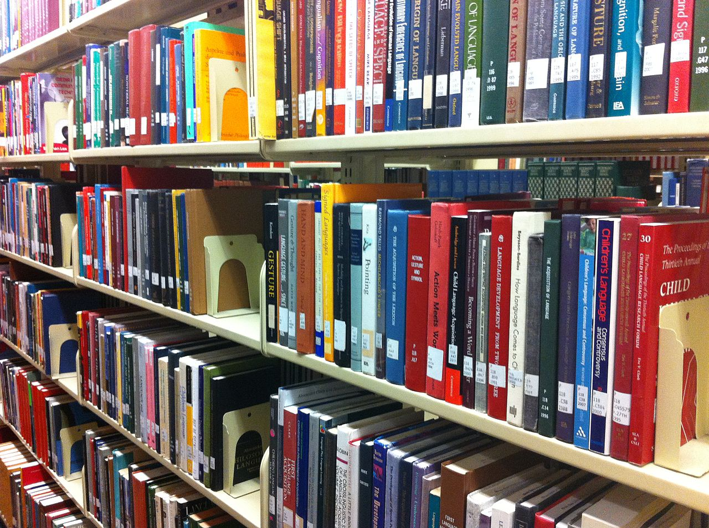
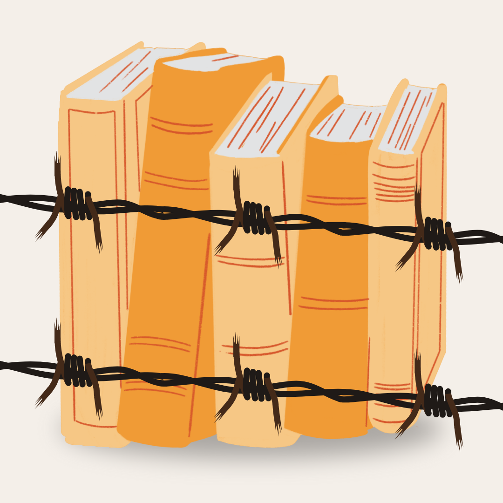
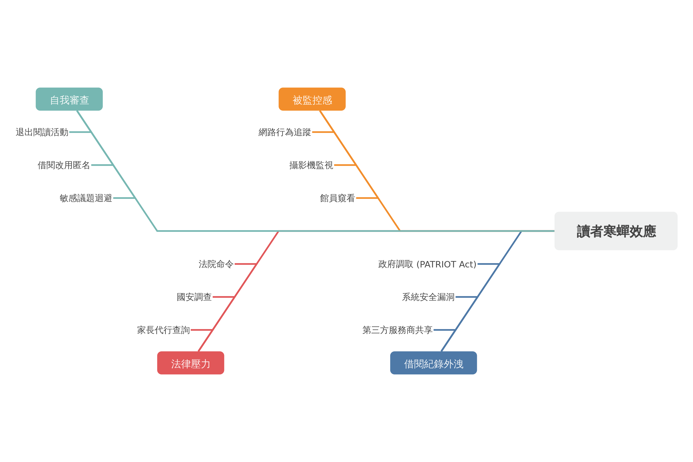
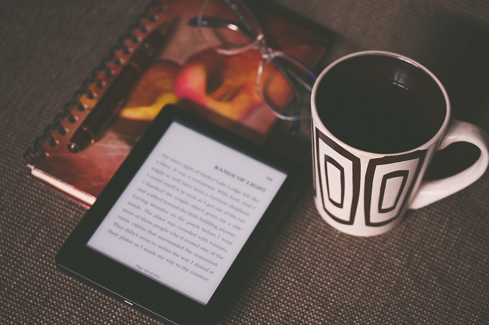
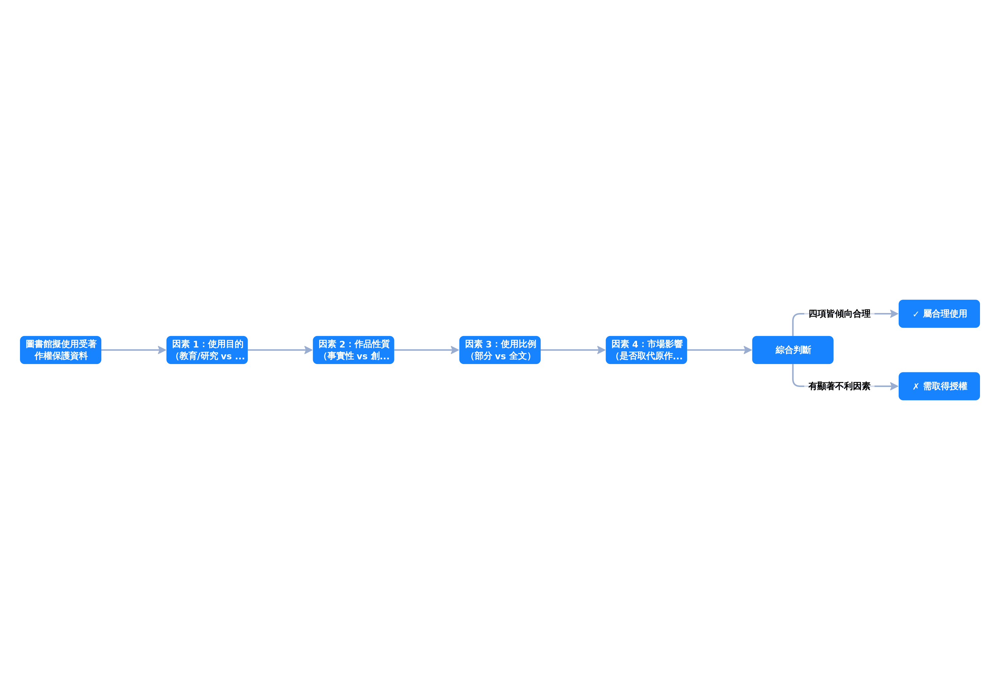

<!-- _class: lead -->

# 圖書館倫理

## 從守則到實務——館員的專業良知與判斷

<!--
Speaker notes: 歡迎各位來到今天的課程。我們將用大約 45 分鐘，一起探討「圖書館倫理」這個看似抽象、卻深深貫穿館員日常工作的主題。
-->

---

<!-- _class: agenda -->

## 今日課程大綱

1. 什麼是圖書館倫理？
2. 知識自由與反審查
3. 讀者隱私為何是核心？
4. 公平近用與館藏發展
5. 中立是神話？當代爭議
6. 數位時代的倫理新課題

<!--
Speaker notes: 整堂課分成六個章節。前半段我們奠定基礎——定義、知識自由、隱私；後半段進入比較有張力的議題——中立爭議與數位倫理。課後你會帶走一套思考圖書館倫理問題的框架。
-->

---

<!-- _class: lead -->

## 第一章

# 什麼是圖書館倫理？

<!--
Speaker notes: 我們從最基本的問題開始——當我們說「圖書館倫理」時，到底在說什麼？它不只是幾條口號，而是館員在真實情境中做專業判斷的依據。
-->

---

<!-- _class: cols -->

## 三大守則——當代圖書館倫理的 SSOT

### 國際視野

- **ALA** 《Library Bill of Rights》與《Code of Ethics》¹
- **IFLA** 《Code of Ethics for Librarians》²
- 強調知識自由、近用平等與智財平衡

### 台灣本土

- 《我國圖書館員專業倫理守則》共 **十條**³
- 明定維護閱讀自由、嚴守業務機密
- 對應國際精神並納入在地語境

<!--
Speaker notes: 當代圖書館倫理有三份權威來源：美國 ALA、國際 IFLA，以及台灣圖書館學會的十條守則。這三份文件不是各說各話，而是共同指向五大軸線——等一下的圖會讓你看得更清楚。
-->

---

<!-- _class: highlight-box -->

## 五大共通軸線——三份守則的交集

- **近用平等**：任何人不得因身份背景而被拒於門外
- **知識自由**：讀者有權接觸各種觀點的資訊
- **讀者隱私**：借閱與探詢行為受保密保護
- **智財平衡**：尊重著作權，同時倡議合理使用
- **專業精進**：持續進修並遵守同儕問責

<!--
Speaker notes: ALA、IFLA、台灣三份守則表面看各自獨立，實際上共通指向這五條軸線。後面五章的核心內容就是把這五軸線逐一展開。
-->

---

<!-- _class: lead -->

## 第二章

# 知識自由與反審查

<!--
Speaker notes: 第一章建立了框架，現在進入第一個核心價值——知識自由。它是圖書館所有倫理原則中，最容易被外部壓力挑戰的一條。
-->

---

<!-- _class: key-point -->

## 知識自由的核心主張

讀者有權接觸**各種觀點的資訊**，包含不受歡迎或具爭議的內容；館員應拒絕將資料因作者背景或立場而排除於館藏之外¹。

<!--
Speaker notes: 這句話要記住——知識自由不是「圖書館什麼都要有」，而是「不能因為觀點不討喜就排除」。兩者差一個字，倫理位置完全不同。
-->

---

<!-- _class: highlight-box -->

## 館員是防線，不是執行者

- 面對政府、商業、宗教的下架壓力，**積極維護**閱讀自由³
- 民意或長官要求下架某書時，館員的倫理位置是**防線**
- 拒絕審查的依據：倫理守則第一條明文授權
- 抵抗需要同儕、學會、法律三重支撐——不是個人英雄主義

<!--
Speaker notes: 這頁的重點是「倫理位置」——館員不是接受命令執行下架的基層人員，而是有守則授權去抵抗的專業工作者。台灣守則第一條寫得非常清楚。
-->

---

<!-- _class: lead -->

## 第三章

# 讀者隱私為何是核心？

<!--
Speaker notes: 隱私乍看跟倫理不直接相關，但它其實是前兩章「自由探詢」的前提。讀者如果覺得自己被監看，就不敢自由閱讀——這不是假設，而是有證據的行為模式。
-->

---

<!-- _class: quote -->

> 讀者有權在**不被觀察的情況下**閱讀、思考、形成信念。一旦隱私失守，讀者會自我審查，產生**寒蟬效應**（chilling effect）。⁴

<!--
Speaker notes: 這段話來自 ALA 對隱私的詮釋。關鍵詞是「寒蟬效應」——人在感覺被監視時會自我審查。這正是為什麼隱私不只是法律問題，而是倫理問題的核心。
-->

---

<!--
Speaker notes: 這張魚骨圖拆解寒蟬效應的成因——從自我審查、被監控感、法律壓力到借閱紀錄外洩，四條主幹同時作用才會導致讀者自我退縮。理解這些成因，館員才知道要從哪些面向去建立防護。
-->

---

<!-- _class: big-number -->

48

個州立法保障借閱紀錄為機密，非經本人同意或正式法院命令不得揭露⁴

美國 / 9·11 後 USA PATRIOT Act 曾擴權，引發圖書館界強烈抵抗

<!--
Speaker notes: 48 這個數字說明——在美國，讀者隱私不只是倫理共識，更是幾乎全國性的法律保障。9/11 之後 PATRIOT Act 想擴大政府調取紀錄的權限，圖書館界起身抵抗，這是倫理實踐的真實案例。
-->

---

<!-- _class: lead -->

## 第四章

# 公平近用與館藏發展

<!--
Speaker notes: 第四章談的是兩個看似分開、但實際上一體兩面的主題——「誰可以進圖書館」與「圖書館要放什麼書」。這兩個問題都指向同一個核心：選擇本身就是倫理決策。
-->

---

<!-- _class: comparison -->

## 公平近用——被動 vs 主動

### 消極理解

「**不拒絕**」任何人進入

- 不驗證身份、不查出身
- 把門打開就算數

VS

### 積極實踐

**主動消除**近用障礙²

- 無家者入館、身障服務
- 非公民借閱、數位落差
- 資訊平權是義務而非恩惠

<!--
Speaker notes: 很多人對「公平近用」的理解停在「不拒絕」，但 IFLA 守則的定義走得更遠——館員有義務主動消除阻礙。這是質的差別。想想看：圖書館有為無家者提供盥洗嗎？為新住民提供多語館藏嗎？這些都是公平近用的真實尺度。
-->

---

<!-- _class: highlight-box -->

## 館藏發展政策——把倫理寫成白紙黑字

- **書面明確規範**選書與淘汰原則、範圍、深度與職責分工⁵
- 爭議性資料（升學、宗教、政治）應在政策中**預先載明處理原則**
- 必要時由**館藏發展委員會**邀請專家協助檢視
- 目的：避免單一館員的個人好惡主導館藏面貌
- 「觀點中立、執行公正、不偏不倚」——三條並列，缺一不可⁵

<!--
Speaker notes: 館藏發展政策是倫理的書面化。它把「我們用什麼標準選書」寫下來，讓每一個選擇都可以被檢視、被問責。這比「我覺得這本書不適合」有力得多——因為政策不是某個人的意見，而是集體共識。
-->

---

<!-- _class: lead -->

## 第五章

# 中立是神話？當代爭議

<!--
Speaker notes: 前四章講的是相對共識的內容，第五章進入當代圖書館學最熱的辯論——「中立」這個概念本身是否成立？這不是學術遊戲，而是關乎館員每天怎麼自我定位的根本問題。
-->

---

<!-- _class: quote -->

> 在本就不平等的社會中，**中立等同於維護既有不平等**，對邊緣群體形同冷漠。⁶

<!--
Speaker notes: 這是批判圖書館學（critical librarianship）近年對中立神話的核心挑戰。它沒有否定中立的價值，而是指出：當社會結構本身就不中立時，館員的「不表態」其實是站在既有秩序那一邊。這段話會直接帶出下一頁的 Berninghausen 辯論。
-->

---

<!-- _class: comparison -->

## Berninghausen 辯論——兩方都源自倫理關懷

### 中立派

行動主義會**動搖保護讀者知識自由的根本義務**⁶

- 館員一旦選邊，就難再替對立觀點的讀者服務
- 中立是專業門檻

VS

### 批判派

拒絕面對結構性壓迫本身就是**一種政治選擇**⁶

- 中立等同維護既有不平等
- 對邊緣群體形同冷漠

<!--
Speaker notes: 關鍵要看到——兩方都是從倫理出發，只是對「中立」的定義不同。中立派認為中立是保護讀者的手段；批判派認為中立已成為迴避責任的藉口。兩個立場沒有誰絕對正確，你要自己在真實情境中判斷。
-->

---

<!-- _class: lead -->

## 第六章

# 數位時代的倫理新課題

<!--
Speaker notes: 最後一章進入數位時代。紙本時代的倫理框架，在數位環境遇到新挑戰——特別是「所有權」消失後，圖書館的角色正在被重新定義。
-->

---

<!-- _class: process -->

## 合理使用——四因素檢測⁷

1

使用目的 （教育 vs 商業）

2

著作性質 （事實 vs 創作）

3

使用比例 （量與質）

4

市場影響 （替代性）

<!--
Speaker notes: 合理使用不是「你想怎麼用都可以」，而是四個因素綜合判斷。圖書館基於教育、研究目的的數位化行為，通常在這個框架下有較大空間——但仍需案例評估，不能一概而論。
-->

---

<!--
Speaker notes: 這張流程圖把剛剛的四因素變成可操作的決策樹。電子書授權是目前最尖銳的議題——授權不是買斷，首次銷售原則失效，圖書館無法像紙本一樣自由外借、保存、館際互借。這正是數位圖書館倫理的前沿。
-->

---

<!-- _class: summary -->

## 今日重點回顧

- 圖書館倫理以 **ALA / IFLA / 台灣守則**為專業判斷依據
- **知識自由**：館員是防線，不是審查執行者
- **讀者隱私**是自由探詢的前提——保密不只是法律問題
- **公平近用**要從「不拒絕」走向「主動消除阻礙」
- **中立爭議**：兩方都源自倫理關懷，差別在定義
- **數位倫理**：合理使用四因素 + 電子書授權挑戰

<!--
Speaker notes: 把這六條記住，你就有了回答大多數圖書館倫理問題的基本框架。倫理不是給標準答案，而是提供你在專業情境中做判斷時的思考座標。
-->

---

## 引用來源（1/2）

1. Library Bill of Rights — https://www.ala.org/advocacy/intfreedom/librarybill （accessed 2026-04-11）
2. IFLA Code of Ethics for Librarians and other Information Workers — https://www.ifla.org/publications/ifla-code-of-ethics-for-librarians-and-other-information-workers-short-version/ （accessed 2026-04-11）
3. 我國圖書館員專業倫理守則 — https://www.lac.org.tw/law/12 （accessed 2026-04-11）
4. Privacy: An Interpretation of the Library Bill of Rights — https://www.ala.org/advocacy/intfreedom/librarybill/interpretations/privacy （accessed 2026-04-11）

<!--
Speaker notes: 前半部的引用來源——國際守則、台灣守則、隱私詮釋。
-->

---

## 引用來源（2/2）

5. 國立臺灣師範大學圖書館館藏發展政策 — https://www.lib.ntnu.edu.tw/files/NTNULIB_CDP.pdf （accessed 2026-04-11）
6. Never Neutral: Critlib and Technology — https://americanlibrariesmagazine.org/2017/01/03/never-neutral-critlib-technology/ （accessed 2026-04-11）
7. Copyright: An Interpretation of the Code of Ethics — https://www.ala.org/tools/ethics/copyright （accessed 2026-04-11）

<!--
Speaker notes: 後半部的引用——館藏發展、批判圖書館學、合理使用詮釋。課後可依編號回查。謝謝大家。
-->
