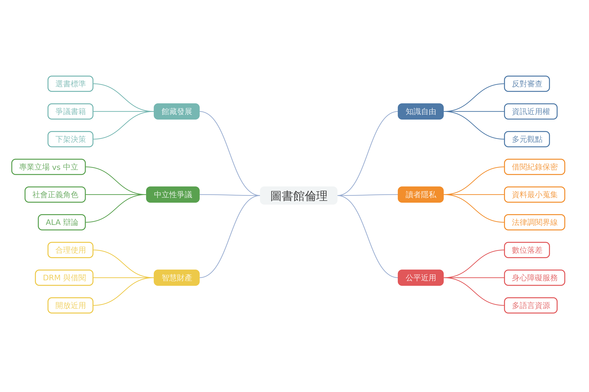

<!-- _class: lead -->

# 圖書館倫理

當代圖書館員的五大倫理軸線 · 約 45 分鐘 · 基礎課

<!--
Speaker notes: 歡迎各位。今天我們要一起來認識圖書館倫理——這不是抽象的道德論辯，而是圖書館員每天在服務台、在選書會議、在面對讀者時都會觸碰到的專業準則。
-->

---

## 今日你會學到

- 圖書館倫理的定義，以及 ALA、IFLA、台灣三大守則的共通原則
- 知識自由與反審查在圖書館實務中的具體意涵
- 讀者隱私保護的倫理依據與寒蟬效應的風險
- 「專業中立性」在當代批判圖書館學視角下的爭議
- 合理使用原則在數位授權情境下的倫理判斷

<!--
Speaker notes: 這五個學習目標對應今天的六個章節。我們會從定義出發、經過核心倫理原則，最後走到數位時代的新課題。
-->

---

<!-- _paginate: false -->

<!--
Speaker notes: 先給大家一張整體地圖。圖書館倫理大致可以攤開成五條軸線：近用平等、知識自由、隱私、智財、專業精進。後面每一章會回來點這張地圖。
-->

---

<!-- _class: lead -->

## 1. 什麼是圖書館倫理？

讀者權益、社會責任、資訊提供者義務——三角平衡

<!--
Speaker notes: 第一章我們先釐清定義。圖書館倫理不是哲學題目，而是館員在提供資訊服務時的專業行為準則，核心任務就是在三種角色之間取得平衡。
-->

---

## 三大守則，五大共通軸線

當代圖書館倫理有三份 SSOT¹²³：

- **ALA**《Library Bill of Rights》+《Code of Ethics》
- **IFLA**《Code of Ethics for Librarians》
- **台灣**《我國圖書館員專業倫理守則》共十條

三者共同關注：**近用平等 · 知識自由 · 隱私 · 智財 · 專業精進**

<!--
Speaker notes: 別被三份守則嚇到——它們的核心關懷高度重疊。美國 ALA 最早、國際圖聯 IFLA 對齊全球、台灣守則則結合本地法律脈絡。你只要記住這五大軸線，等於掌握三份守則的 80%。這五條就是三大守則的最大公約數。
-->

---

<!-- _class: lead -->

## 2. 知識自由與反審查

讀者有權接觸各種觀點——即使是不受歡迎的

<!--
Speaker notes: 第二章進入倫理第一支柱：知識自由。這是所有專業守則的開篇條款，也是館員最容易被誤解的角色。
-->

---

<!-- _class: quote -->

## 館員是防線，不是執行者

> 館員應積極維護閱讀自由，抗拒來自政府、商業、宗教等不當檢查與壓力。
>
> ——《我國圖書館員專業倫理守則》第一條³

面對「請下架這本書」的外部壓力，館員的倫理位置是守門人。

<!--
Speaker notes: 這一條很關鍵。當有民意代表、長官、甚至家長來要求下架某本書時，館員不是公務執行者，而是專業守門人。這不是反抗權威，而是履行專業義務。
-->

---

<!-- _class: lead -->

## 3. 讀者隱私為何是核心？

「讀者有權在不被觀察的情況下閱讀、思考、形成信念」⁴

<!--
Speaker notes: 第三章來到隱私。為什麼借閱紀錄要保密？不只是法律，更是自由探詢的前提——一旦讀者覺得自己被監看，就會自我審查，這就是寒蟬效應。
-->

---

## 從 USA PATRIOT Act 學到的⁴

- 美國 **48 州**立法保障借閱紀錄為機密
- 非經本人同意或正式法院命令不得揭露
- 9/11 後 USA PATRIOT Act 擴大調取權限 → 圖書館界強烈抵抗
- 台灣守則第十條：嚴守業務機密、維護讀者隱私³

隱私失守 = 讀者自我審查 = 寒蟬效應

<!--
Speaker notes: PATRIOT Act 是經典案例。911 之後政府想大規模調取借閱紀錄，全美圖書館界集體反彈——這不是政治立場，是專業倫理的必然展現。台灣的守則第十條精神一致。
-->

---

<!-- _class: lead -->

## 4. 公平近用與館藏發展

「任何人不得因出身、年齡、背景或觀點而被拒於圖書館門外」¹

<!--
Speaker notes: 第四章把兩個主題合併討論：公平近用和館藏發展。因為它們其實是一體兩面——你怎麼選書，就決定了誰能被服務。
-->

---

<!-- _class: card -->

## 館藏發展政策是倫理決策

**公平近用不是消極地「不拒絕」**

- 積極消除阻礙：無家者入館、非公民借閱、身心障礙、數位落差²
- **書面政策**載明選書、淘汰、爭議資料處理原則⁵
- 中立原則 = 觀點中立 + 執行公正 + 不偏不倚⁵
- 爭議資料由館藏發展委員會協助檢視，避免個人好惡主導

<!--
Speaker notes: 很多人以為「選書」是中性的專業判斷，但其實每一次選與不選都是倫理決策。好的館藏發展政策會把決策標準寫下來，讓選書不是靠館員個人喜好。
-->

---

<!-- _class: lead -->

## 5. 中立是神話？

當代批判圖書館學的挑戰⁶

<!--
Speaker notes: 第五章我們要挑戰前面的「中立」預設。批判圖書館學這一派認為，中立本身就是一種政治立場——而且通常是維護既有不平等的那一邊。
-->

---

## Berninghausen 辯論⁶

半世紀前的老辯論，至今未解：

**A 方：嚴守中立**
館員行動主義會動搖保護讀者知識自由的根本義務

**B 方：無法中立**
拒絕面對結構性壓迫，本身就是一種政治選擇

兩方都源自倫理關懷，只是對「中立」定義不同

<!--
Speaker notes: 這不是新爭議——半世紀前的 Berninghausen 辯論就談過了。重點是：兩方都出於倫理關懷，只是對中立的定義不同。你不需要選邊，但你需要知道這場辯論的存在。
-->

---

<!-- _paginate: false -->

<!--
Speaker notes: 這張魚骨圖把「中立的爭議」這個結果，拆成幾條可能的原因脈絡：社會結構、資源分配、館員訓練、制度設計。大家可以想想，自己的機構裡，哪一條最明顯？
-->

---

<!-- _class: lead -->

## 6. 數位時代的新倫理

電子書不是「數位化的紙本」——它是完全不同的法律客體

<!--
Speaker notes: 最後一章進入 21 世紀的新戰場。電子書、串流、授權——這些東西把「首次銷售原則」這個圖書館賴以為生的法律基礎整個抽掉。
-->

---

## 合理使用四因素檢測⁷

ALA 守則要求館員在使用者與權利人之間倡議平衡。合理使用允許圖書館基於教育、研究目的複製或數位化部分館藏——**必須通過四因素檢測**：

1. 使用目的與性質（教育 / 商業）
2. 受著作性質
3. 使用的質與量
4. 對潛在市場的影響

<!--
Speaker notes: 合理使用不是一句口號——它是四條具體因素組成的法律檢測。每次你要重製、數位化、館際互借時，都要能回答這四題。
-->

---

<!-- _paginate: false -->

<!--
Speaker notes: 這張流程圖把四因素檢測變成一個判斷樹，讓你在實務情境中快速判斷某個使用行為是不是合理使用。真要遇到模糊地帶，還是要諮詢法務。
-->

---

## 電子書 vs 紙本：斷裂的首次銷售原則⁷

| 紙本書 | 電子書 |
|---|---|
| **買斷** | **授權** |
| 首次銷售原則適用 | 首次銷售原則**不適用** |
| 自由外借、保存、館際互借 | 受授權條款限制 |
| 可捐贈、可轉讓 | 通常不可轉讓 |

這是當前數位圖書館倫理的前沿議題。

<!--
Speaker notes: 重點在這張表。紙本我們買斷了就是我們的，電子書是授權——出版商可以單方面改條款、甚至收回。圖書館的「保存義務」在電子時代變得非常脆弱。
-->

---

<!-- _class: card -->

## 三個常見誤解

- ❌「圖書館就該提供所有書，所以沒有倫理問題」
  → 館藏有預算與空間限制，**選什麼本身就是倫理決策**
- ❌「館員保密是法律問題，不是倫理問題」
  → 即使法律沒規定，**隱私仍是專業倫理核心**；法律只是底線
- ❌「中立就是什麼都不表態」
  → 中立是對「觀點」不偏袒，**不等於對歧視、審查袖手旁觀**

<!--
Speaker notes: 結束前幫大家點三個常見誤解。這些都是從研究文獻裡歸納出來的實務迷思，也是今天六章的核心回應。
-->

---

<!-- _class: summary -->

## 今日重點回顧

- 圖書館倫理 = 讀者權益 · 社會責任 · 資訊提供者義務三角平衡
- 五大軸線：**近用平等 · 知識自由 · 隱私 · 智財 · 專業精進**
- 館員是反審查的防線，不是執行者
- 隱私守護 = 自由探詢的前提；法律是底線，倫理才是核心
- 「中立」是持續爭議中的概念，不是預設立場
- 數位時代：合理使用四因素 + 授權 ≠ 買斷

<!--
Speaker notes: 我們今天走了一趟從定義、原則、到當代爭議的完整路線。這五條重點是最值得你帶回去的——下次在實務現場遇到決策困境時，回來對照這張清單。
-->

---

## 引用來源（1/2）

[^1]: Library Bill of Rights — https://www.ala.org/advocacy/intfreedom/librarybill （accessed 2026-04-11）

[^2]: IFLA Code of Ethics for Librarians and other Information Workers (short version) — https://www.ifla.org/publications/ifla-code-of-ethics-for-librarians-and-other-information-workers-short-version/ （accessed 2026-04-11）

[^3]: 我國圖書館員專業倫理守則 — https://www.lac.org.tw/law/12 （accessed 2026-04-11）

[^4]: Privacy: An Interpretation of the Library Bill of Rights — https://www.ala.org/advocacy/intfreedom/librarybill/interpretations/privacy （accessed 2026-04-11）

<!--
Speaker notes: 這是今天引用的第一組來源，主要是 ALA、IFLA、台灣圖書館學會的正式守則，以及 ALA 對隱私議題的官方詮釋。
-->

---

## 引用來源（2/2）

[^5]: 國立臺灣師範大學圖書館館藏發展政策 — https://www.lib.ntnu.edu.tw/files/NTNULIB_CDP.pdf （accessed 2026-04-11）

[^6]: Never Neutral: Critlib and Technology — https://americanlibrariesmagazine.org/2017/01/03/never-neutral-critlib-technology/ （accessed 2026-04-11）

[^7]: Copyright: An Interpretation of the Code of Ethics — https://www.ala.org/tools/ethics/copyright （accessed 2026-04-11）

<!--
Speaker notes: 第二組是館藏發展實例、批判圖書館學立場文章、以及 ALA 對智財與合理使用的詮釋。有興趣可以從這幾篇延伸。
-->
